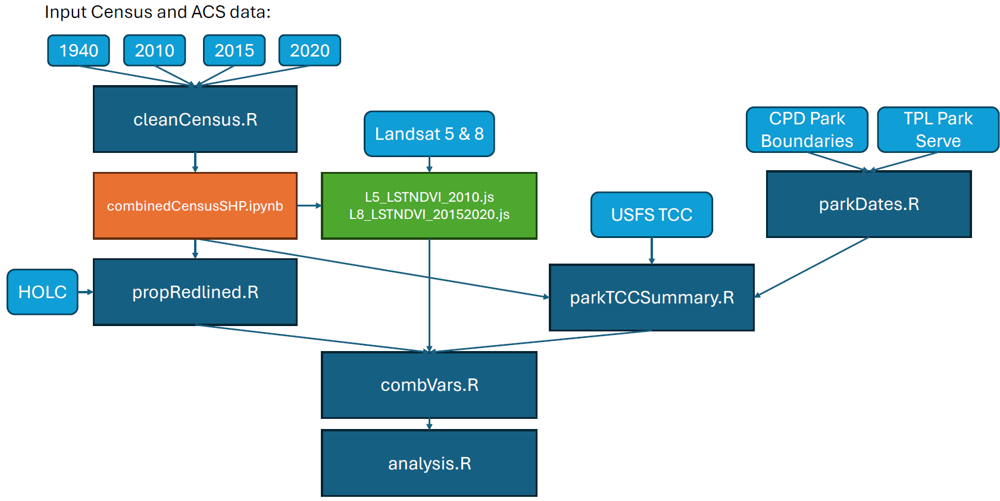

# The divergent environmental trajectories of formerly redlined communities: A time series analysis of green investment in Chicago
This study examines the environmental trajectories—in terms of overall greenness, tree canopy coverage, and new park space—in formerly redlined communities in Chicago between 2010 and 2020. We find that neighborhoods with lower redlining grades (C and D) often showed greater increases in greening, although these increases declined in the latter half of the study period (2015–2020). Divergent greening patterns were also observed within C- and D-graded areas: census tracts characterized by an increase in homeownership after redlining showed higher greening investment than those where homeownership declined between 1940 and 2020. 

## Citation:
Stuhlmacher, M. and Kim, J. (2025) "The divergent environmental trajectories of formerly redlined communities: A time series analysis of green investment in Chicago". Landscape and Urban Planning.

## Methdology Diagram:

Light blue boxes represent input data, dark blue is R code, orange is Python, and green is Google Earth Engine. 

# Software Requirements:
R version 4.4.2
Google Earth Engine (JavaScript API)
Python (Jypter Notebook)
